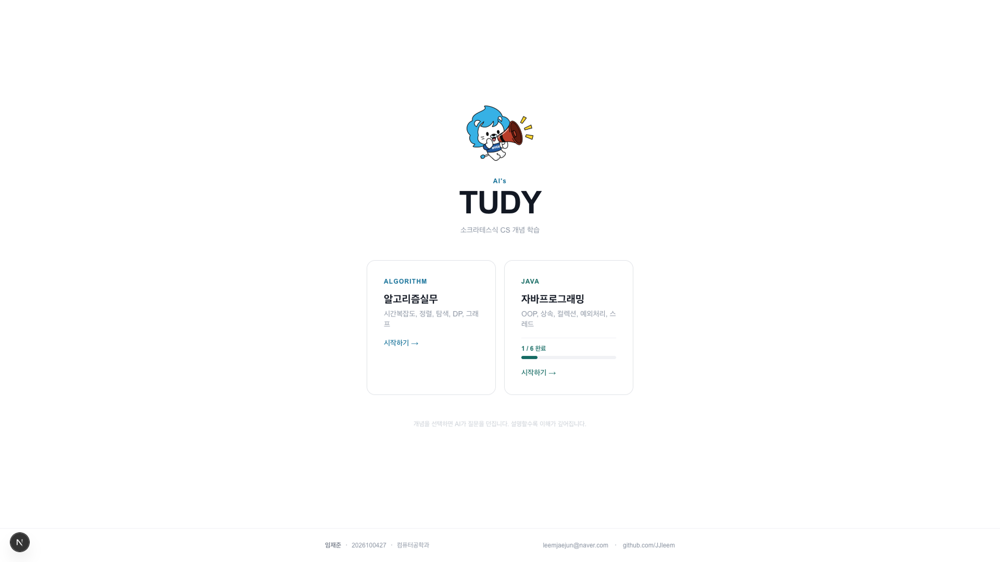
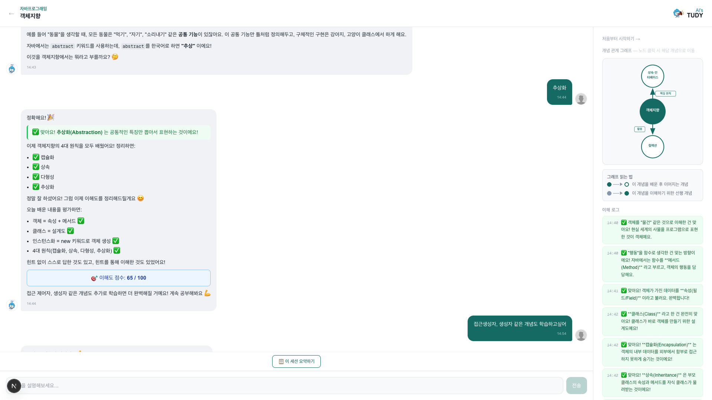
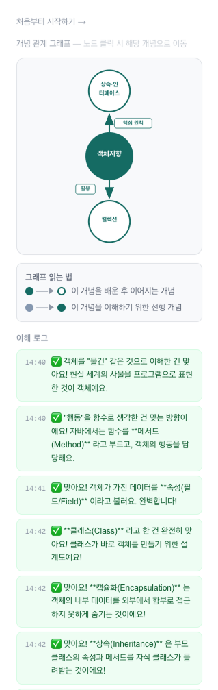
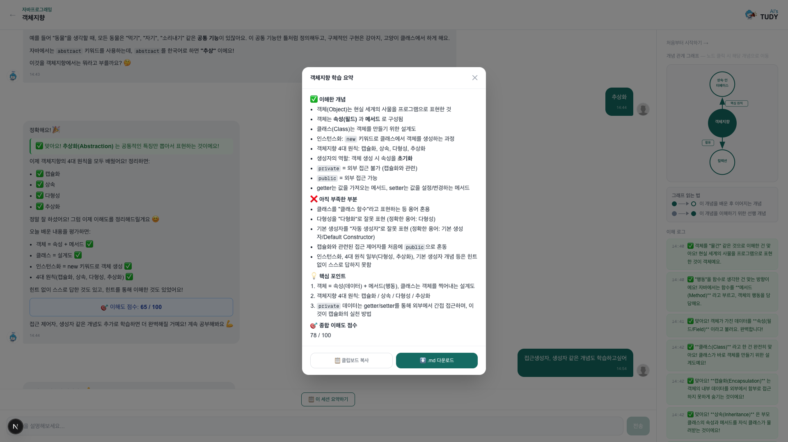
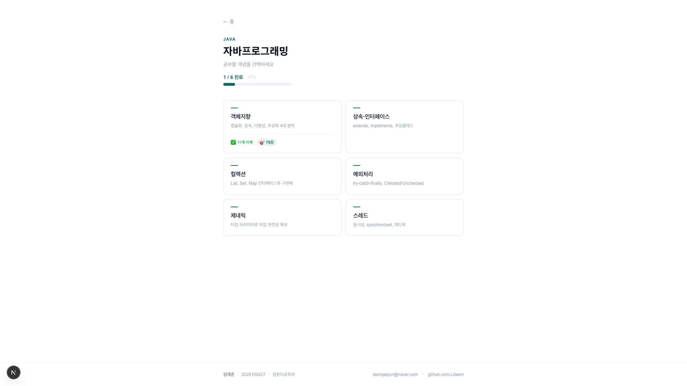

# AI's TUDY — 소크라테스식 CS 학습 웹앱

> **2026학년도 HYCU AI 학습법 공모전** 출품작  
> "AI가 설명해주는 게 아니라, 내가 설명해야 이해된다"

<!-- 📸 스크린샷: 홈화면 전체 (로고 + 과목 카드 2개) -->


---

## 개요

**AI's TUDY**는 Claude AI를 활용한 소크라테스식 CS 개념 학습 도구입니다.  
일반적인 AI 튜터와 반대로, AI가 먼저 설명하지 않습니다.  
학생이 개념을 설명하면 AI가 피드백하고, 빠진 부분을 **질문으로 유도**합니다.

설명할수록 이해가 깊어지는 구조입니다.

---

## 주요 기능

### 1. 소크라테스 대화
- 개념 선택 시 AI가 "X가 무엇인지 본인의 말로 설명해보세요"로 시작
- 학생 답변 → AI 피드백 → 빠진 부분 질문 → 반복
- 6번째 턴부터 이해도 점수(0–100) 실시간 표시
- 100점 달성 전까지 "다른 개념 배우기" 없음 — 끝까지 파고듦

<!-- 📸 스크린샷: 대화 화면 (피드백 초록/빨강 블록 + 점수 박스 보이는 상태) -->


### 2. 피드백 UI
| 블록 | 의미 |
|---|---|
| ✅ 초록 블록 | 맞게 이해한 부분 |
| ❌ 빨강 블록 | 빠지거나 틀린 부분 |
| 🎯 파랑 박스 | 이해도 점수 (XX / 100) |

### 3. 개념 관계 그래프
- SVG 기반 개념 관계 시각화
- 노드 클릭 시 해당 개념으로 바로 이동

<!-- 📸 스크린샷: 개념 그래프 (SVG 노드 + 관계선 보이는 상태) -->


### 4. 이해 로그 패널
- 사이드바에 타임스탬프 + 이해한 항목 누적
- 세션 종료 후에도 사이드바에서 복습 가능

### 5. 세션 요약
- 8턴 이후 "이 세션 요약하기" 버튼 활성화
- ✅ 이해한 개념 / ❌ 부족한 부분 / 💡 핵심 포인트 / 🎯 점수 자동 생성
- `.md` 다운로드 또는 클립보드 복사

<!-- 📸 스크린샷: 요약 모달 (스트리밍 요약 내용 보이는 상태) -->


### 6. 진도 배지 & 세션 영속성
- 홈 / 과목 선택 화면에서 학습 진도 배지 표시
- `localStorage` 기반 세션 저장 — 창을 닫고 다시 열어도 이어보기

<!-- 📸 스크린샷: 과목 선택 화면 (진도 배지 표시된 상태) -->


---

## 커버 개념

### 알고리즘실무 (6개)
시간복잡도 · 정렬 · 이진탐색 · 재귀 · 동적프로그래밍 · 그래프탐색

### 자바프로그래밍 (6개)
OOP · 상속/인터페이스 · 컬렉션 · 예외처리 · 제네릭 · 멀티스레딩

---

## 기술 스택

| 영역 | 기술 |
|---|---|
| Frontend | Next.js 16 (App Router) + TypeScript + Tailwind CSS v4 |
| Backend | Next.js API Routes (SSE 스트리밍) |
| AI | Claude API — `claude-sonnet-4-6` |
| 영속성 | localStorage (DB 없음) |
| 배포 | Vercel |

---

## 로컬 실행

```bash
# 1. 의존성 설치
npm install

# 2. 환경 변수 설정
echo "ANTHROPIC_API_KEY=sk-ant-여기에_키_입력" > .env.local

# 3. 개발 서버 실행
npm run dev
```

브라우저에서 `http://localhost:3000` 접속

### 환경 변수

```
ANTHROPIC_API_KEY=sk-ant-...
```

---

## 프로젝트 구조

```
app/
├── app/
│   ├── page.tsx                    # 홈 (과목 선택)
│   ├── [course]/
│   │   ├── page.tsx                # 개념 선택 그리드
│   │   └── [concept]/
│   │       └── page.tsx            # 학습 세션
│   └── api/
│       ├── chat/route.ts           # Claude SSE 스트리밍
│       └── summary/route.ts        # 세션 요약 생성
├── components/
│   ├── SocratesChat.tsx            # 대화 UI + localStorage 영속성
│   ├── SessionClient.tsx           # 세션 레이아웃 (이해로그, 초기화)
│   ├── ConceptGraph.tsx            # 개념 관계 SVG 그래프
│   ├── ConceptCard.tsx             # 개념 카드 (점수·이해 수 표시)
│   └── CourseProgressBadge.tsx     # 과목별 진도 배지
└── lib/
    ├── concepts.ts                 # 12개 개념 데이터 + 엣지 관계
    └── prompts.ts                  # 소크라테스 시스템 프롬프트
```

---

## localStorage 구조

| 키 | 내용 |
|---|---|
| `chat_{conceptId}` | 대화 메시지 배열 |
| `insights_{conceptId}` | 이해 로그 배열 |
| `score_{conceptId}` | 최근 이해도 점수 |
| `summary_{conceptId}` | 세션 요약 텍스트 |

---

## 소크라테스 프롬프트 설계

턴 수에 따라 학습 단계가 자동으로 진행됩니다:

| 턴 | 단계 |
|---|---|
| 1 | 초기 평가 — feedback-good / feedback-bad 필수 |
| 2–3 | 피드백 심화 — 미커버 체크포인트 중심 |
| 4 | 심화 질문 — 실제 코드 / 엣지케이스 |
| 5 | 중간 정리 — score-box 필수 포함 |
| 6+ | 심화 학습 — 매 턴 점수 업데이트, 100점 전 종료 금지 |

**절대 규칙:** 직접 설명 금지 · 한 번에 질문 하나 · 한국어 전용 · 6줄 이내

---

## 라이선스

MIT
